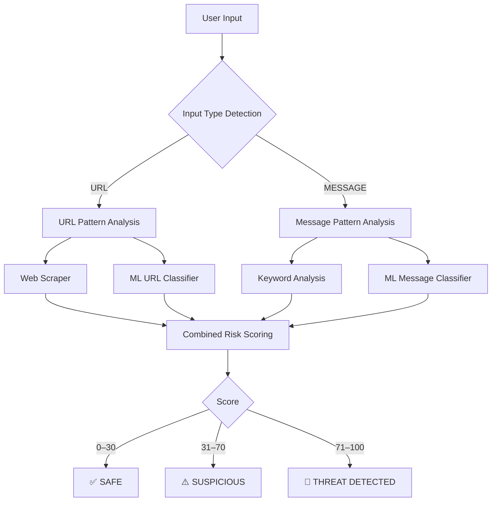

# 🛡️ SecureAssist — AI-Powered Phishing & Threat Detector

A hybrid phishing and threat detection system combining **machine learning** and **rule-based analysis** to identify malicious URLs and suspicious messages — with a premium dark web UI.

🔗 **Live Repo**: [github.com/Sreelakshmi-K-S/SecureAssist](https://github.com/Sreelakshmi-K-S/SecureAssist)

---

## 🎯 Overview

SecureAssist analyzes two types of input:
- **URLs** — Detects phishing domains, suspicious TLDs, IP-based URLs, homograph attacks
- **Messages** — Detects scam language, urgency cues, credential requests, reward scams

It uses a **hybrid approach**:
1. **ML Models** — Random Forest classifiers (trained on 150 MB+ of real phishing data)
2. **Rule-Based Detection** — 30+ heuristic checks
3. **Web Scraping** — Fetches page content for brand spoofing and password field detection
4. **Combined Risk Scoring** — All signals merged into a 0–100 risk score

---

## ✨ Features

| Feature | Details |
|---------|---------|
| 🤖 ML-Powered | Random Forest with 85–98% accuracy |
| 🔍 35+ Rule Checks | URL patterns, TLDs, keywords, homographs, redirects |
| 🌐 Web Scraper | Extracts title, forms, links, page text for content analysis |
| 📊 Risk Dashboard | Clean dark UI with animated score bar and threat indicator list |
| 📋 Multi-Input | Accepts both URLs and plain text messages |
| 🐳 Docker Ready | One-command deployment |

---

## 🏗️ System Architecture



---

## 📂 Project Structure

```
SecureAssist/
├── app.py               # Flask app — routes and session handling
├── input_detector.py    # Auto-detects URL vs Message; 12+ URL checks, 12+ message checks
├── rules.py             # Hybrid scoring: ML + rule-based + scraped content
├── score_engine.py      # Final decision (Safe / Suspicious / Phishing Alert)
├── advisor.py           # Human-readable recommendation messages
├── ml_predictor.py      # ML model loader and predictor
├── scraper.py           # Scrapes URLs for metadata, forms, links (html2image preview)
├── train_model.py       # Model training script
│
├── templates/
│   ├── index.html       # Scan input page (dark hero UI)
│   └── result.html      # Analysis result dashboard
│
├── static/
│   ├── css/style.css    # Full dark design system
│   ├── js/              # Frontend scripts
│   └── previews/        # Auto-generated website screenshots
│
├── data/                # Training datasets (gitignored — add your own)
│   ├── url3.csv         # URL phishing data (~42 MB)
│   └── msg.csv          # Message spam data (~107 MB)
│
├── models/              # Trained ML models (gitignored — generated by train_model.py)
├── requirements.txt
├── Dockerfile
└── TRAIN_MODELS.md
```

---

## 🚀 Quick Start

### 1. Clone the repo
```bash
git clone https://github.com/Sreelakshmi-K-S/SecureAssist.git
cd SecureAssist
```

### 2. Install dependencies
```bash
pip install -r requirements.txt
```

### 3. (Optional) Train ML models
> Skip this if you don't have datasets — the app runs with rule-based detection only.
```bash
python train_model.py
```
*Training takes 5–10 minutes. See `TRAIN_MODELS.md` for dataset format.*

### 4. Run the app
```bash
python app.py
```

### 5. Open in browser
```
http://localhost:7860
```

---

## 💻 Usage

1. Go to `http://localhost:7860`
2. Paste a **URL** or **suspicious message** into the scan bar
3. Click **Analyze**
4. View the result dashboard:
   - 🔴 / 🟡 / 🟢 Risk badge (Threat / Suspicious / Safe)
   - Risk score (0–100) with animated progress bar
   - Per-indicator threat list with severity tags
   - Website preview and metadata (for URLs)

### Example Inputs

| Input | Expected Result |
|-------|----------------|
| `https://google.com` | ✅ Safe |
| `http://paypal-verify-account.ml/login` | 🚨 Threat Detected |
| `http://bit.ly/free-iphone` | ⚠️ Suspicious |
| `Congratulations! You won $1000. Click here now!` | 🚨 Threat Detected |
| `Hey, let's meet for coffee tomorrow` | ✅ Safe |

---

## 📊 How Detection Works

### URL Checks (`input_detector.py`)
- Insecure HTTP protocol
- IP address as domain
- Suspicious TLDs (`.ml`, `.tk`, `.xyz`, `.top` …)
- URL shorteners (bit.ly, tinyurl …)
- Excessive subdomains / hyphens
- Suspicious keywords in domain or path (`login`, `verify`, `banking` …)
- `@` symbol (credential phishing)
- Long URLs, redirect parameters
- Homograph attacks (Cyrillic lookalike characters)

### Message Checks (`input_detector.py`)
- Urgency language, threats, reward/prize claims
- Credential and financial keyword detection
- ALL CAPS and excessive punctuation
- Embedded email addresses and phone numbers

### Web Content Analysis (`scraper.py` + `rules.py`)
- Password fields on HTTP pages
- Brand spoofing (PayPal/Google/Microsoft in title of wrong domain)
- Suspicious page keywords
- External link ratio

### Scoring
```
Final Score = ML Score + Rule Score + Scraper Score   (clamped to 100)

0–30   → Safe
31–70  → Suspicious
71–100 → Phishing Alert 🚨
```

---

## 🤖 ML Model Details

| Model | Algorithm | Features | Accuracy |
|-------|-----------|----------|----------|
| URL Classifier | Random Forest (100 trees) | Character n-grams, 5000 features | 85–95% |
| Message Classifier | Random Forest (100 trees) | Word TF-IDF, 5000 features | 90–98% |

The app runs **without models** if they haven't been trained — rule-based detection still works.

---

## 🐳 Docker Deployment

```bash
docker build -t secureassist .
docker run -p 7860:7860 secureassist
```

---

## 🛠️ Configuration

**Change port** — edit `app.py`:
```python
port = int(os.environ.get("PORT", 7860))
```

**Adjust risk thresholds** — edit `score_engine.py`:
```python
if score < 30:   return "Safe"
elif score < 70: return "Suspicious"
else:            return "Phishing Alert"
```

---

## 🔧 Troubleshooting

| Problem | Solution |
|---------|---------|
| `⚠ ML models not available` | Run `python train_model.py` |
| `ModuleNotFoundError` | Run `pip install -r requirements.txt` |
| Port already in use | Change `PORT` env variable or edit `app.py` |
| Screenshot not working | Install Chrome/Edge — required by `html2image` |

---

## 📚 Tech Stack

- **Backend**: Python, Flask
- **ML**: scikit-learn (Random Forest, TF-IDF)
- **Scraping**: requests, BeautifulSoup, html2image
- **Frontend**: Vanilla HTML/CSS/JS — IBM Plex Mono + Syne fonts
- **Deployment**: Docker, gunicorn

---

## 🔒 Security Note

This tool is for **educational and research purposes**. No detection system is 100% accurate. Always verify suspicious links independently and never enter credentials on untrusted sites.

---

**Made with 🛡️ to fight phishing**
